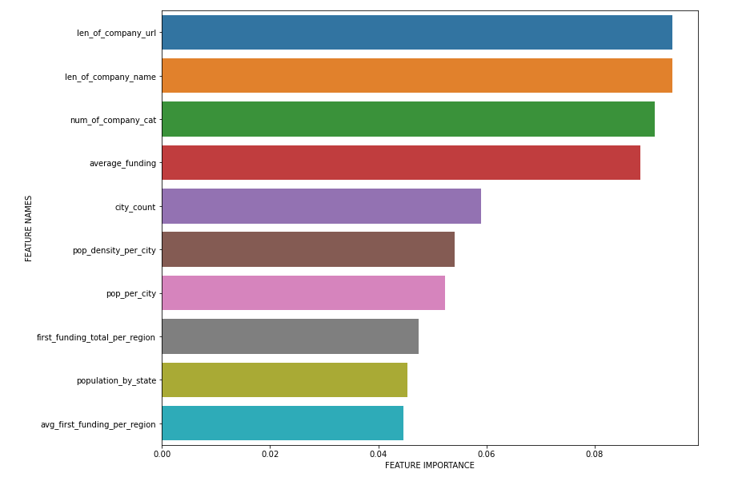
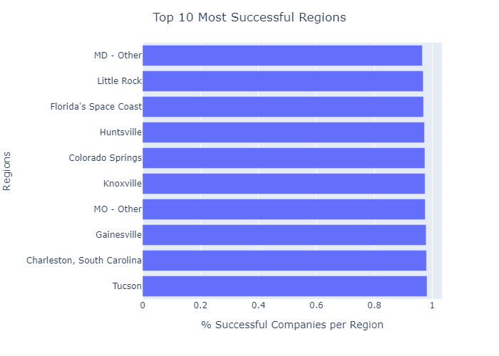
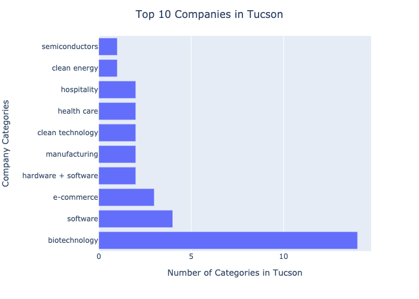
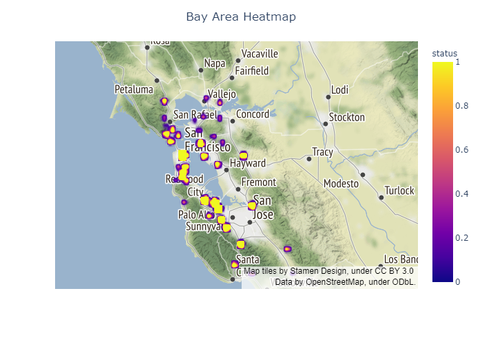
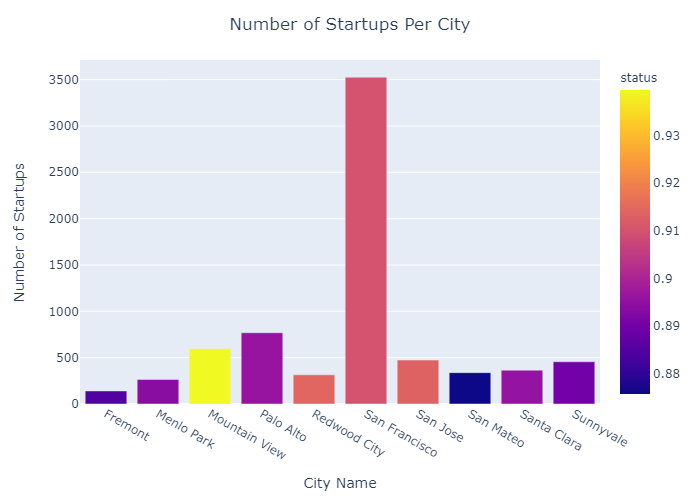
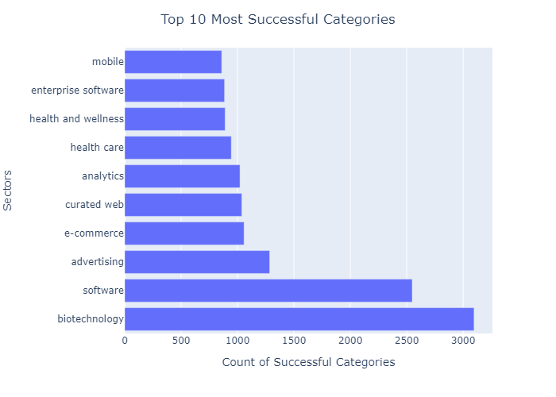

<a href="https://www.crunchbase.com"></a>

# Startup Success and Predictive Modeling 
<br>

## An analysis of success, failure, and designing a predictive model
<br>

___

__Abstract:__
Data from [https://data.world/fiftin/crunchbase-2015] consists of 66,368 rows (companies) with 14 columns primarily describing funding and location. The data starts from 1960 and goes to 2015. This dataset was combined with GDP information [https://hub.arcgis.com](https://hub.arcgis.com/datasets/a2a8826c4ba44f89a684000fe7c05b8c_0/data?geometry=-166.940%2C29.270%2C167.571%2C67.358&page=5), population statistics [https://simplemaps.com/data](https://simplemaps.com/data/us-zips), and education data [https://data.world/education/university-rankings-2017]. After conducting an exploratory analysis, I have found a predictive relationship between select features and success or failure of a startup.


__Results:__
After conducting EDA and modeling, Logistic Regression speaks to startup categories such as big data, realestate, and medicine to be important to success. Less obvious features such as the length of a company name or their url also play a role. Interestingly, the number of startups in a city and the city's overall population plays a role in success as well.

Random Forest found importance with the population of areas, how much finance was given to a specific company, and the average finance of companies in regions. While this does not speak to the why of importance, it does show that location is an important factor.


___
# Background & Motivation
Investment strategy is key to the survival of investment firms. Knowing what company to invest in to get a return and not a loss is key. Smart investment is good for investment firms, startups, and both local and the global economy. Decisions made on good data, smart reasoning and well designed modeling can create better investment strategy.

___
# The Problem
* Investment strategy and loss can be a major issue.
* Across my dataset 32,000,000,000$ has been lost due to investments that have failed.


# The Solution
* Creating smart predictive models and feature analysis can hedge loss and create more profit
* Models can be tuned for missed opportunity or investment risk

___
# Analysis methods

Four separate ```.csv``` files were used in data collection. The primary dataset pulled from Data.World and consists of over 63 thousand different startup businesses from many different regions from around the world. For my study, I narrowed companies down to the United States only. GDP information was pulled from Arcgis, US city population statistics were pulled from Simple Maps, and education data was pulled from a secondary source found on Data.World. Primary data analysis was conducted using ```pandas``` and ```numpy```. Data visualization was conducted with ```matplotlib```, and ```plotly```.

Primary modeling was conducted with Logistic Regression and Random Forest Classifier. These models were selected to be used in tandem. Logistic Regression is an easily interpretable model giving insightful coefficients, while the Random Forest model provides strong predictive power. It is important to note, all models were crossfold validated and tuned for recall as the primary measure.

Recall was selected as it emphasizes in lowering the false negative rate. This is important because a false positive results in missed opportunity (predicting a business will fail but it succeeds), but a false negative results in financial loss for an investment firm. If an investment firm is more concerned about opportunity loss, model tuning can be adjusted to emphasize false positives.


___
# Results

After balancing classes with SMOTE, the baseline classifier model gave a 50% accuracy score. Logistic Regression resulted in a model with around 70% recall score. Furthermore, logistic regression revealed an important relationship in company success: company types more likely to succeed and city population statistics. This may seem obvious, but this tells an important story--successful ecosystems build successful companies. In short: location matters!

A random forest classifier was also built and optimized with recall in mind. Recall was selected as the primary metric to reduce loss of investment. Once tuned, this model has a recall score of 98%. When looking at the feature importances of this model, some interesting potential relationships are revealed.


Information about city populations and average funding in the city plays a large role. This hints at the importance of location. After further EDA, it seems like larger cities with more financial backing is important to success.

When looking at the top 10 most successful cities, an interesting pattern emerges. There seems to be an importance in company grouping. This revals company insight. There is a reason they are grouping. Further investigation would be needed to explain why.



This grouping can also be seen in an area such as San Francisco's Bay Area. There are clusters that are more successful, while other clusters have more failures. This again speaks to the importance of location. According to modeling conducted, this can be partially attributed to how much income a city has, how dense the population is, and the average funding received for companies in an area. Further analysis on other features should be conducted.



When looking at the more predictive features, we can see some trends develop with some outliers. Looking at the number of startups in a city (in the SF Bay area for example) as a predictive feature, it is apparent it can make a difference in some cities. Mountain View serves as a clear outlier, however San Jose, San Francisco, and Redwood city hold positive to this trend. To confirm this further, a deeper analysis should be conducted on each city.




When looking at which categories tend to be more invted in, we can see clear trends in biotechnology and softwhere. This may be due to the



___
# An Interaction of Systems
My final conclusion is the importance of ecosystems. Some locations do better than others. This indicates there must be some features about these areas that contribute to success. Further work should be done on a more granular scale. Some features to potentially add in the future include non-startup businesses, more precise geolocation information per company, more precise city statistics.


___
## Limitations
It is important to note correlation doesn't equal causation. Success of a company can depend on many different micro and macro interactions. The data in this study was more macro and did not have specifics on each individual company. What this study did conclude, is some sort of relationship and patterns in location. This is important because it indicates more research is necessary.
___
