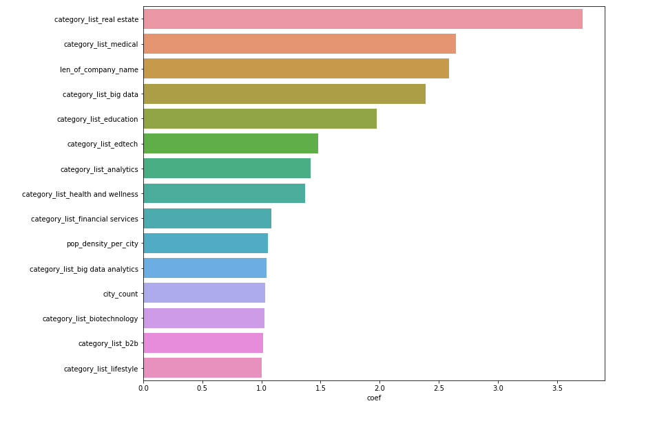

<a href="https://www.crunchbase.com"></a>

# Startup Success and Predictive Modeling 
<br>

## An analysis of success, failure, and designing a predictive model
<br>

___

__Abstract:__
Startup Data, collected from [https://data.world]([https://data.world/fiftin/crunchbase-2015) consists of 66,368 rows (companies) with 14 columns primarily describing funding and location. The data starts from 1960 and goes to 2015. This dataset was combined with GDP information [https://hub.arcgis.com](https://hub.arcgis.com/datasets/a2a8826c4ba44f89a684000fe7c05b8c_0/data?geometry=-166.940%2C29.270%2C167.571%2C67.358&page=5), population statistics [https://simplemaps.com/data](https://simplemaps.com/data/us-zips), and education data [https://data.world/education/university-rankings-2017]. After conducting an exploratory analysis, a predictive modeling revealed key relationships between select features and a startup's success.


__Results:__
After conducting EDA and predictive modeling, Logistic Regression emphasized startup categories such as big data, realestate, and biotech to be safe investments. Less obvious features such as the length of a company name or their url also play a role, and it can be speculated as to why. Perhaps companies with more financial reach can secure shorter urls and names. Interestingly, the number of startups in a city and the city's overall population plays a role in success. This indicates the importance of location and speaks to a more complex success ecosystem within some cities. Optimized Logistic Regression achieved a recall score of 69%.


Using Random Forest as a more robust predictive model, permutation feature importance reveals different feature importance. Startups do better in cities with higher population density. Furthermore, the more financial backing a location has the higher the odds a company will succeed become. Most interestingly, cities with higher numbers of unique industries also perform better. These features could be speaking to the importance of a diverse and supported ecosystem, or they could all be saying startups in cities perform better. More study will be needed to make a conclusion.


___
# Background & Motivation
Investment strategy is key to the survival of investment firms. Knowing what company to invest in to get a return and not a loss is key. Smart investment is good for investment firms, startups, and both local and the global economy. Decisions made on good data, smart reasoning and well designed modeling can create better investment strategy.

___
# The Problem
* Investment strategy and loss can be a major issue.
* Across my dataset 32,000,000,000$ has been lost due to investments that have failed.


# The Solution
* Creating smart predictive models and feature analysis can hedge loss and create more profit
* Models can be tuned for missed opportunity or investment risk

___
# Analysis methods

Four separate ```.csv``` files were used in data collection. The primary dataset pulled from Data.World and consists of over 63 thousand different startup businesses from many different regions from around the world. For my study, I narrowed companies down to the United States only. GDP information was pulled from Arcgis, US city population statistics were pulled from Simple Maps, and education data was pulled from a secondary source found on Data.World. Primary data analysis was conducted using ```pandas``` and ```numpy```. Data visualization was conducted with ```matplotlib```, ```seaborn```, and ```plotly```.

Primary modeling was conducted with ```sklearn``` Logistic Regression and Random Forest Classifier. These models were selected to be used in tandem. Logistic Regression is an easily interpretable model giving insightful coefficients, while the Random Forest model provides strong predictive power. It is important to note, all models were crossfold validated and tuned for recall as the primary measure.

Recall was selected as it emphasizes in lowering the false negative rate. This is important because a false positive results in missed opportunity (predicting a business will fail but it succeeds), but a false negative results in financial loss for an investment firm. If an investment firm is more concerned about opportunity loss, model tuning can be adjusted to emphasize false positives.


___
# Results

After balancing classes with SMOTE, minimizing outliers, and reducing multicollinearity, the baseline classifier model gave a 50% accuracy score. Logistic Regression resulted in a model with around 69% recall score. Logistic Regression was selected for it's interpretability. Looking at the coefficients, it can be seen some categories of startups are safer to invest in than others. Logistic Regression also reveals the importance of population density and the number of startups in a city as key predictors of success. These two factors are important because they talk about the importance of location. To discover more about the features of location, a more granular study will need to be conducted.



An optimized Random Forest Classifier was used as the more robust predictive model. This model was optimized to provide a high recall score. Recall was selected as the primary metric to reduce loss of investment. Once tuned, this model has a recall score of 98%. When looking at the feature importances of this model, some interesting potential relationships are revealed. Features seem to be grouped in terms of funding, population, and the count of startups in a location. Once again, these features seem to be talking about the importance of location to success, but they may all be saying the same thing: larger cities do better. This makes sense as larger cities have more funding, more education, and a diverse workforce to draw upon. However to make conclusive statements, more study is needed.


Looking at the top 10 most successful locations, interesting insight can be gained. These locations are not locations someone would typically think of as successful. And that in part is to how they were selected. Locations with 100% success rate were not used, as these were locations with 1 to 2 different startups that had not failed. But larger cities such as San Francisco are not represented because they have more startups in their area, and thus are not around the 95% mark. These areas can then be seen as the top 10 upcoming areas. They all have roughly 100 to 50 different startups in their location and all have a high success rate.


When looking at Tucson specifically for example, we can see another interesting insight. Likewise companies cluster together. Tucson has a high number of biotechnology in the region, and this happens to be one of the most successful company types to predict success according to the Logistic Regression model. This pattern can be seen in other locations as well. Likewise companies cluster and this seems to create more success than isolated industries.


The importance of location can also be seen. When looking at a heatmap of success of the bay area, clear areas of success and failure can be seen. This does not reveal why these locations are better than others, but shows the importance of location in terms of success. It can also be argued that successful companies start off in one location and move to more successful areas later. Or perhaps these are companies being funded by companies like Google or Facebook and are less likely to fail as a result. More investigation is needed.


When looking at the predictive features revealed in modeling, we can see some trends develop, but also some outliers that do not fit these trends. The below graph demonstrates outliers in Mountain View, and the skew of larger cities such as San Francisco. Success is an interaction of features, and narrowing down that statement to a handful of features does not grasp the complexity properly.


___
# An Interaction of Systems
My final conclusion is the importance of ecosystems. Some locations do better than others. This indicates there must be some features about these areas that contribute to success. Further work should be done on a more granular scale. Finding the select features that create this success ecosystem can help investment strategy as well as many other industries.


___
## Limitations and Future Work
It is important to note the limitations of this study. Data collected was not as granular as it could have been, and thus predictions are rough. Success of a company can depend on many different micro and macro interactions. Further research and study will be required to learn more about what makes a location successful.
___
